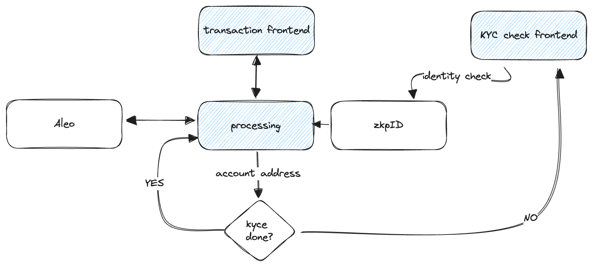

# Aleo Privacy Pool using zkpID

The project demonstrates how a Privacy Pool facilitates compliant but privacy-preserved Aleo transactions. Depending on the amount of a transaction an identity check is triggered. If the identity check was successfully completed the transaction can be send to a receiver.

For demonstration purposes the process is rather simplified, e.g. is the check of the receiver, exception handling, and a region-specific threshold amount out of scope. The objective is to show the general mechanisms as a proof of concept.

The figure below shows the basic components of the project. The blue boxes are part of the application: the transaction frontend and the processing component are in the `src/` folder. You find the KYC check frontend in the `kycfrontend/` folder. zkpId is provided as an API this repository connects to.



## Basic user flow

* _Precondition: the user has a Leo wallet installed and Aleo credits available on the account._
* _Assumption: user identity check is required if the transaction amount is higher than 15 Aleo_

### Transaction amount below the threshold

Alice opens the **transaction frontend** in her browser. After connecting the Leo Wallet the wallet address is shown on top of the page. Alice enters the amount of 5 Aleo and Bob's Aleo account address. When Alice clicks the **Send** button the transaction is transferred to the PrivacyPool and forwarded to Bob's account.

### Transaction amount above the threshold

Alice opens the **transaction frontend** in her browser. After connecting the Leo Wallet the wallet address is shown on top of the page. Alice enters the amount of 20 Aleo and Bob's Aleo account address. Clicking the **Send** button the application checks if the address is already identity-checked.

If (a) the address has not performed an identity check the button changes to **Start KYC**. When Alice clicks the button then another tab opens and starts the identity check. During this check Alice shows her Id documents and captures a selfie, the data is processed and validated and the result of the identity check is stored in the zkpID component.

If (b) the address has already performed a identity check the KYC status is shown the the transaction is to the Privacy Pool and forwarded to Bob's account.

## Getting the code

The demo application is build with vite based on the Aleo demo repository (_source here_) . The KYC check application in the `kycfrontend/` subfolder is a simple next.js application with just a single page.

Clone the repository

```bash
git clone git@github.com:etoneclab/zkpid-aleo-demo.git
```

and install the node modules in the root folder:

```bash
npm install
```

## Environment Variables

Next create a `.env` file for the environment variables in the root folder with the following variables:

```bash
VITE_ZKPID_SERVER      = https://zkpid.zkp-id.com
VITE_ZKPID_SERVER_PORT = 443
VITE_KYC_FRONTEND      = http://localhost
VITE_KYC_FRONTEND_PORT = 3000
```

And another file `kycfrontend/.env` in the folder for the KYC check application with the following content:

```bash
AUTHORIZATION_KEY  = <zkpId customer authorization key here>
SECRET_KEY         = <zkpId customer secret key here>
AUTH_SERVER        = "https://auth.zkp-id-com"
AUTH_SERVER_PORT   = "443"
ZKPID_SERVER       = "https://zkpid.zkp-id-com"
ZKPID_SERVER_PORT  = "443"
```

Create a free trial account at zkpID to retrieve an _authorization key_ and a _secret key_.

## Start the application

Start the KYC check frontend:

```bash
cd kycfrontend
npm run dev
```

and then the demo application:

```bash
cd ..
npm run dev
```

## Technical Documentation

See [README.md](./doc/README.md) in the `doc/` folder for the technical details of the PoC.

See [README.md](./kycfrontend/README.md) in the `kycfrontend/` folder for the technical details of the KYC Frontend.
