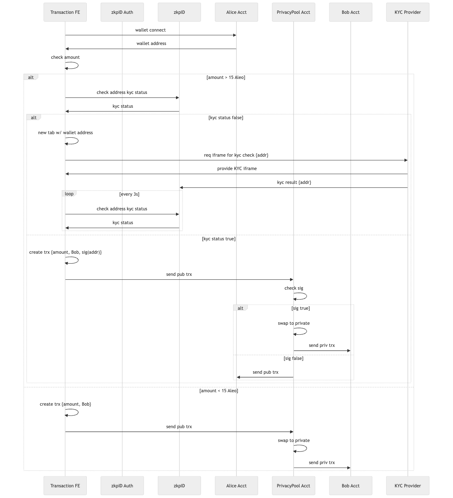

# Technical Structure

The demo application is build on the VITE framework. The Demo application includes x components:

* The user frontend for the transfer form
* The user frontend for the kyc validation
* The Aleo program acting as an escrow account, validating the kyc status and forwards the transfer to the receiver
* The zkpID service providing the KYC service

The figure below shows the application flow.


## The User Frontend for the Transfer From

The frontend for the user is the entry point for the user journey. It is a browser application based on [VITE](https://vitejs.dev/). The user connects to the wallet via `@demox-labs` and interacts with the Leo Wallet as a graphical interface for the Aleo account. The frontend checks the account balances and the availability of the Aleo program.

The frontend checks the amount and triggers the KYC process (user identification) if the amount is above a certain threshold. For illustration purposes the threshold is set to 15 Aleo.

The code assumes that the Leo wallet is installed as the browser extension.

The heavy load of the program is done in the `execution.jsx` file. There are several `useEffect()` methods to respond to state changes. The core state it the KYC state which are currently multiple state variables and what can be changed to a more elaborated state engine.

The application checks if the sender's address is KYC-ed and continues if the  **zkpID Service** responds with a signature.

### Environment Variables

The following environment variables (file: `.env`) are required to run the frontend, and point to the **zkpID Service** and the **KYC frontend service**:

```bash
VITE_ZKPID_SERVER=https://zkpid.zkp-id.com
VITE_ZKPID_SERVER_PORT=443
VITE_KYC_FRONTEND=http://localhost
VITE_KYC_FRONTEND_PORT=3000
```

## The User Frontend for the KYC validation

The frontend (see `./kycfrontend`) for the KYC validation is build on the Nextjs framework because it keeps sensitive data connects directly to the KYC provider for security and privacy reasons build as an iFrame. The iFrame is specific for the vendor used for this demo ([iDenfy](https://www.idenfy.com/))

The result of the KYC validation is send to the **zkpID Service** as the contractual partner of the KYC provider. The KYC status of an address can be checked at the API of the **zkpID Service**.

See `./kycfrontend/README.md` for information how to install and run.

### Environment Variables

The following environment variables (file: `.env`) are required to run the KYC service, and point to the **zkpID Auth Service** and the **zkpID Service** with the respective customer credentials:

```bash
AUTHORIZATION_KEY  = <AUTHORIZATION_KEY>
SECRET_KEY         = <SECRET_KEY>
AUTH_SERVER        = "https://auth.zkp-id.com"
AUTH_SERVER_PORT   = "443"
ZKPID_SERVER       = "https://zkpid.zkp-id.com"
ZKPID_SERVER_PORT  = "443"
```

## The Aleo program

The Aleo program (see `./leo/escrow/`) is a leo program deployed on the network.
The program takes the transfer data (receiver and amount) and the signature of the senders address and forwards the transferred amount if the signature is valid.

The program is kept rather simple and doesn't include the conversion from public to private and transfer via private transactions.

See `./leo/escrow/README.md` for information how to install and run.

### Environment Variables

The following environment variables (file: `.env`) are required for the leo caller account: 

```bash
NETWORK=testnet3
PRIVATE_KEY=APrivateKey1zkpF3yErBh6UnGeWzAZ9DTQ2X96DiGCke5o6LCN1jFHDz51
```